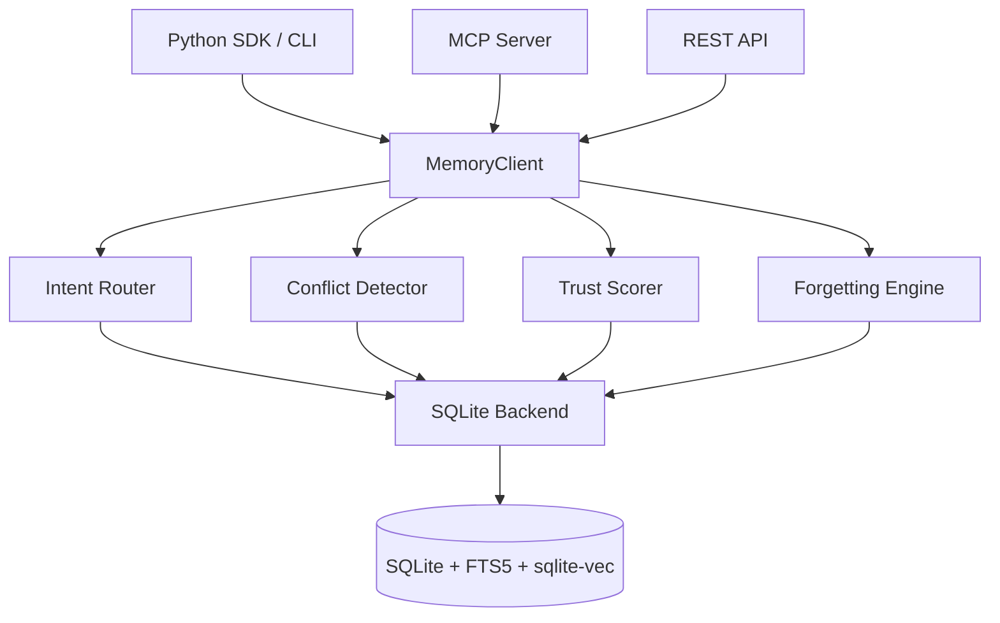

# agent-memory


Zero-config, traceable, MCP-native long-term memory for agents.

`agent-memory` targets a gap in the current memory stack: a local-first engine that works with `pip install`, runs on pure SQLite, and makes memory evolution explainable instead of opaque.

## Why this exists

- `Mem0` proves demand, but pulls in heavier infra such as Neo4j or Qdrant.
- Local agents and personal copilots need a memory layer that is easy to embed, debug, export, and ship.
- Interviews love this surface area: storage, retrieval, ranking, decay, provenance, conflict handling, MCP, and evaluation.

## Current Status

- SQLite backend with WAL, FTS5, audit log, evolution log, entity index, and causal parent links
- Schema indexes for type, layer, recency, trust, source, relation, and audit hot paths
- Python SDK via `MemoryClient`
- Rule-based intent router with Reciprocal Rank Fusion
- Adaptive forgetting utilities with dual-threshold layer transitions
- Heuristic conflict detection with contradiction edges and trust-score adjustment
- Optional LLM-backed conflict adjudication for top semantic candidates
- Governance helpers for health reports, audit reads, and JSONL export/import
- Optional MCP server and REST API adapters with dependency-friendly fallbacks
- `sqlite-vec` integration with safe fallback to Python cosine scan when unavailable
- Deterministic local fallback embeddings for testability and zero-friction startup
- LLM-first conversation extraction with heuristic fallback
- Trace graph reports with ancestors, descendants, relations, and evolution history
- Idempotent maintenance cycle for decay, promotion/demotion, conflict upkeep, and consolidation
- Benchmark helpers and LOCOMO-Lite style starter data

## Quickstart

```bash
pip install -e .[dev]
.venv/bin/python -m pytest -q
```

```bash
agent-memory store "User prefers SQLite for local-first agents." --source-id demo
agent-memory search "Why SQLite?"
agent-memory health
```

```python
from agent_memory import MemoryClient

client = MemoryClient()
item = client.add(
    "The user prefers SQLite for local-first agent projects.",
    source_id="demo-session",
)

results = client.search("What database does the user prefer?")
print(results[0].item.content)

trace = client.trace_graph(item.id)
print(trace.descendants)

health = client.health()
print(health.suggestions)
```

## Architecture



### Core components

- `src/agent_memory/client.py` — high-level SDK entry point
- `src/agent_memory/storage/sqlite_backend.py` — SQLite persistence, FTS, vector fallback, trace queries
- `src/agent_memory/controller/router.py` — intent-aware retrieval routing and RRF fusion
- `src/agent_memory/controller/forgetting.py` — Ebbinghaus-inspired adaptive forgetting
- `src/agent_memory/controller/conflict.py` — contradiction detection and conflict records
- `src/agent_memory/controller/consolidation.py` — overlap grouping and merge-draft generation
- `src/agent_memory/controller/trust.py` — multi-factor trust scoring
- `src/agent_memory/governance/health.py` — stale/orphan/conflict monitoring
- `src/agent_memory/interfaces/mcp_server.py` — eight MCP tools
- `src/agent_memory/extraction/pipeline.py` — conversation-to-memory extraction
- `benchmarks/` — storage/retrieval microbenchmarks and synthetic eval seeds

### Design choices

- **SQLite + WAL** keeps deployment zero-config while fitting agent workloads: many reads, occasional writes.
- **Rule routing over LLM routing** keeps routing latency predictable and testable.
- **RRF instead of score averaging** avoids calibration problems across lexical, entity, and semantic retrieval.
- **`sqlite-vec` plus fallback** gives C/SQL vector search when available while keeping the package runnable everywhere.
- **Soft delete** preserves provenance and causal trace integrity.
- **Hash fallback embeddings** make the package runnable even before a local embedding model is available.
- **Unique relation edges** keep maintenance idempotent and health metrics stable.

## Project layout

```text
agent-memory/
├── docs/plans/
├── examples/
├── src/agent_memory/
│   ├── controller/
│   ├── embedding/
│   ├── extraction/
│   └── storage/
└── tests/
```

## Benchmarks

Synthetic LOCOMO-Lite run on the bundled starter dataset (`30` dialogues / `150` questions):

| Metric | `agent-memory` | Semantic-only baseline |
|--------|----------------|------------------------|
| Overall hit rate | 50.0% | 23.3% |
| Factual recall | 53.3% | 6.7% |
| Temporal recall | 36.7% | 3.3% |
| Causal recall | 53.3% | 6.7% |
| p95 retrieval latency | 16.64ms | 11.50ms |

- Full report: `docs/benchmark-results.md`
- Re-run locally: `python benchmarks/locomo_lite/evaluate.py`

## MCP Usage

Install MCP support and launch the stdio server:

```bash
pip install -e .[mcp]
python -m agent_memory.interfaces.mcp_server
```

Claude Desktop configuration:

```json
{
  "mcpServers": {
    "agent-memory": {
      "command": "python",
      "args": ["-m", "agent_memory.interfaces.mcp_server"],
      "env": {
        "AGENT_MEMORY_DB_PATH": "/absolute/path/to/default.db"
      }
    }
  }
}
```

Typical tools:

- `memory_store` — store a memory with provenance
- `memory_search` — run intent-aware retrieval
- `memory_trace` — inspect causal ancestry and evolution
- `memory_health` — inspect stale/conflict/orphan metrics

More details: `docs/mcp-integration.md`

## Demos

- `python examples/demo_cross_session.py --db /tmp/agent-memory-demo.db`
- `python examples/interactive_chat.py --db chat_memory.db --provider none`
- `python examples/mcp_server.py`

## Release Notes

- `benchmarks/locomo_lite/latest_results.json` is regenerated by the evaluation script
- `docs/screenshots/` is reserved for verified MCP client screenshots
- Update GitHub URLs if you publish under a different org/user
- Delivery record and full tutorial: `docs/project-delivery-and-tutorial.md`
- Expansion and optimization review: `docs/plans/2026-03-24-agent-memory-expansion-review.md`

## Dev Notes

- Run all tests with `.venv/bin/python -m pytest -q`
- Use the built-in CLI with `agent-memory --help`
- `sqlite-vec` is installed as a package dependency; if the extension cannot be loaded at runtime, vector search safely falls back to Python cosine scan
- Try microbenchmarks with `python benchmarks/bench_storage.py` and `python benchmarks/bench_retrieval.py`
- Try the demo runner with `python examples/benchmark_runner.py`
