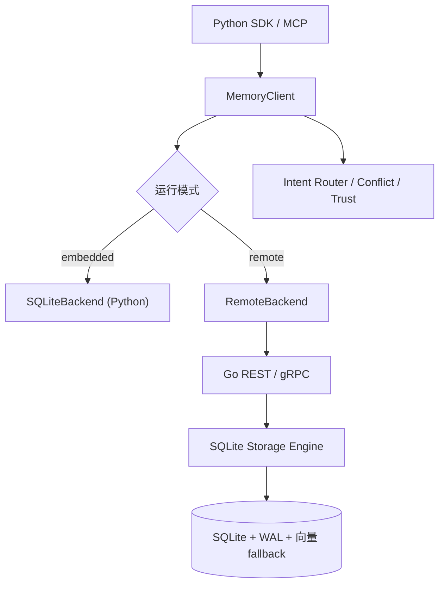

# agent-memory

[English](README.md) | [简体中文](README.zh-CN.md)


一个零配置、可追溯、MCP 原生的 Agent 长期记忆引擎。

`agent-memory` 关注当前记忆基础设施中的一个明显缺口：开发者需要一个可通过 `pip install` 直接使用、运行在纯 SQLite 上、并且能够解释记忆演化过程的本地优先记忆系统。

从 PyPI 安装：

```bash
pip install agent-memory-engine
```

当前已发布版本：`0.2.1`

## 文档

- 英文文档索引：`docs/README.md`
- 中文文档索引：`docs/zh-CN/README.md`
- 项目交付与完整教程：`docs/zh-CN/project-delivery-and-tutorial.md`
- MCP 集成指南：`docs/zh-CN/mcp-integration.md`
- 发布与 PyPI 指南：`docs/zh-CN/release-and-pypi.md`
- Benchmark 报告：`docs/zh-CN/benchmark-results.md`

## 为什么做这个项目

- `Mem0` 证明了长期记忆的需求存在，但依赖 Neo4j、Qdrant 等更重的基础设施。
- 本地 Agent、Copilot 和个人自动化工作流需要一个易于嵌入、调试、导出和发布的记忆层。
- 这个项目覆盖了存储、检索、排序、遗忘、溯源、冲突处理、MCP 和评测等多个有代表性的技术面。

## 当前能力

- 基于 SQLite 的后端，包含 WAL、FTS5、审计日志、演化日志、实体索引和因果父节点
- 新增 Go 服务工作区，包含 SQLite 存储引擎、Schema 迁移、REST 网关、gRPC 服务、认证钩子、指标、Tracing 初始化和 Cobra CLI
- 覆盖类型、层级、时间、信任分、来源和关系的 Schema 索引
- 基于 `MemoryClient` 的 Python SDK
- `MemoryClient` 现在支持 `embedded` 与 `remote` 双模式，可在 Python 内嵌运行，也可走 Go 服务
- 服务模式下，融合检索编排可以直接在 Go 服务层执行，并通过 REST/gRPC 暴露
- 基于规则的意图路由与 RRF 融合排序
- 双阈值层级切换的自适应遗忘策略
- 启发式冲突检测与矛盾关系维护
- 面向 Top semantic candidates 的可选 LLM 冲突复判
- 健康检查、审计读取、JSONL 导出导入等治理能力
- 支持可选 MCP Server 与 REST API 适配层
- `sqlite-vec` 检索与 Python 余弦 fallback 双路径
- 可离线运行的 deterministic fallback embeddings
- LLM 优先、规则兜底的对话记忆提取
- 支持祖先、后代、关系和演化历史的 Trace Graph
- 可重复执行的维护周期：衰减、升降层、冲突维护、巩固
- 自带 benchmark 工具与 LOCOMO-Lite 风格数据集

## 快速开始

```bash
agent-memory store "用户偏好 SQLite 做本地优先 Agent 项目。" --source-id demo
agent-memory search "用户偏好什么数据库？"
agent-memory health
```

开发环境：

```bash
pip install -e '.[dev]'
.venv/bin/python -m pytest -q
```

```python
from agent_memory import MemoryClient

client = MemoryClient()
item = client.add(
    "The user prefers SQLite for local-first agent projects.",
    source_id="demo-session",
)

results = client.search("What database does the user prefer?")
print(results[0].item.content)

trace = client.trace_graph(item.id)
print(trace.descendants)

health = client.health()
print(health.suggestions)
```

### 服务模式

```bash
make proto
cd go-server && go run ./cmd/server
```

```bash
export AGENT_MEMORY_MODE=remote
export AGENT_MEMORY_GO_SERVER_URL=http://127.0.0.1:8080
export AGENT_MEMORY_GRPC_TARGET=127.0.0.1:9090
agent-memory search "为什么选择 SQLite？"
```

## 架构



## 核心组件

- `src/agent_memory/client.py` — 高层 SDK 入口
- `src/agent_memory/storage/remote_backend.py` — 连接 Go 服务的 REST/gRPC 桥接层
- `proto/memory/v1/` — 共享 Protobuf 契约
- `go-server/cmd/server/main.go` — 带优雅关停的 Go 服务入口
- `go-server/internal/storage/sqlite.go` — Go 存储引擎
- `go-server/internal/gateway/handler.go` — Go REST 处理器
- `go-server/internal/grpc/server.go` — Go gRPC 实现
- `src/agent_memory/storage/sqlite_backend.py` — SQLite 持久化、FTS、向量 fallback 与 trace 查询
- `src/agent_memory/controller/router.py` — 意图路由与 RRF 融合
- `src/agent_memory/controller/forgetting.py` — Ebbinghaus 启发式遗忘
- `src/agent_memory/controller/conflict.py` — 冲突检测与冲突记录
- `src/agent_memory/controller/consolidation.py` — 重叠记忆分组与 merge draft 生成
- `src/agent_memory/controller/trust.py` — 多因子信任评分
- `src/agent_memory/governance/health.py` — 陈旧/孤儿/冲突监控
- `src/agent_memory/interfaces/mcp_server.py` — 八个 MCP 工具
- `src/agent_memory/extraction/pipeline.py` — 对话到记忆的提取管线
- `benchmarks/` — 存储/检索微基准和合成评测

## 设计选择

- **SQLite + WAL**：零配置，同时适配“多读、少量写”的 Agent 工作负载。
- **规则路由而不是 LLM 路由**：延迟更稳定、行为可测、结果更可解释。
- **RRF 而不是直接拼分数**：解决不同检索策略之间分数不可比的问题。
- **`sqlite-vec` + fallback**：有高性能路径，也保留全环境可运行性。
- **软删除**：保留因果链和溯源链的完整性。
- **Hash fallback embeddings**：即使本地模型还没准备好也能启动。
- **唯一关系边**：让维护任务可重入、健康指标更稳定。

## Benchmark 摘要

在自带的合成 LOCOMO-Lite 数据集（`30` 段对话 / `150` 个问题）上：

| 指标 | `agent-memory` | 纯 semantic baseline |
|------|----------------|----------------------|
| 整体命中率 | 50.0% | 23.3% |
| Factual 命中率 | 53.3% | 6.7% |
| Temporal 命中率 | 36.7% | 3.3% |
| Causal 命中率 | 53.3% | 6.7% |
| p95 检索延迟 | 16.64ms | 11.50ms |

- 完整报告：`docs/zh-CN/benchmark-results.md`
- 本地复现：`python benchmarks/locomo_lite/evaluate.py`

## MCP 使用

安装 MCP 依赖并启动 stdio server：

```bash
pip install -e .[mcp]
python -m agent_memory.interfaces.mcp_server
```

更多说明见：`docs/zh-CN/mcp-integration.md`

## 示例

- `python examples/demo_cross_session.py --db /tmp/agent-memory-demo.db`
- `python examples/interactive_chat.py --db chat_memory.db --provider none`
- `python examples/mcp_server.py`

## 发布相关

- 变更记录：`CHANGELOG.md`
- 项目交付与教程：`docs/zh-CN/project-delivery-and-tutorial.md`
- 发布与 PyPI 指南：`docs/zh-CN/release-and-pypi.md`
- 扩展与优化建议：`docs/zh-CN/plans/2026-03-24-agent-memory-expansion-review.md`

## 开发提示

- 运行测试：`.venv/bin/python -m pytest -q`
- 查看 CLI 帮助：`agent-memory --help`
- 如果 `sqlite-vec` 运行时不可用，会自动退回 Python 余弦扫描
- 存储/检索微基准：`python benchmarks/bench_storage.py`、`python benchmarks/bench_retrieval.py`
- Demo runner：`python examples/benchmark_runner.py`
