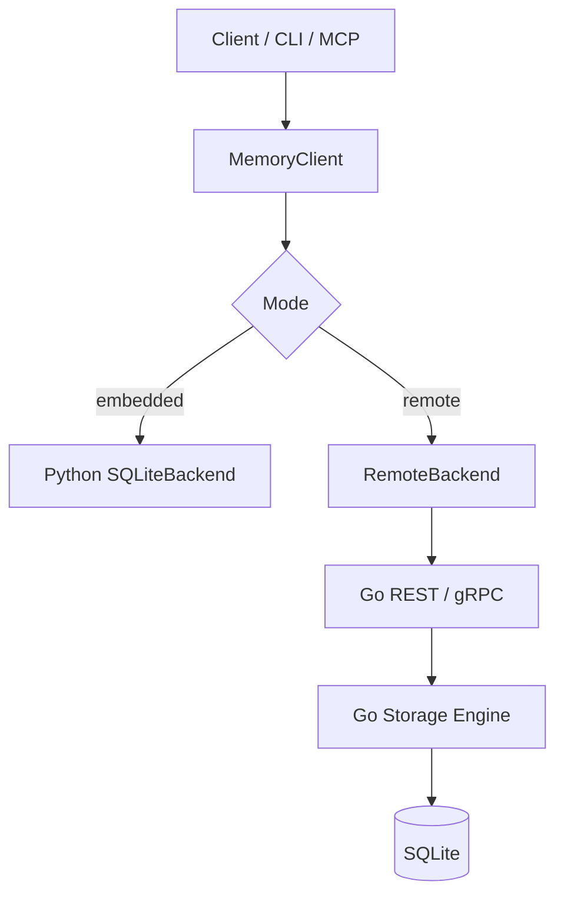
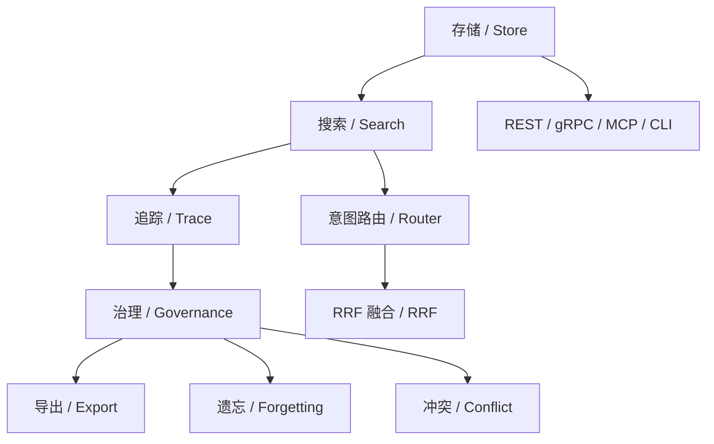

# 01 项目总览与动机
> 从问题背景、设计目标和仓库结构三个层面，建立对 Agent Memory Engine 的整体认识。

## 前置知识

- 无

## 本文目标

完成阅读后，你将理解：

1. 什么是 Agent 长期记忆，以及为什么 LLM Agent 需要它
2. 这个项目试图解决什么工程问题
3. 为什么仓库选择 `SQLite`、`Go + Python`、`Protobuf` 和 `RRF`
4. 后续各篇教学文档分别负责回答什么问题

## 什么是 Agent 记忆

大语言模型 (Large Language Model, LLM) 本身没有跨会话持久状态。一次对话结束后，模型参数不会因为这次交互而自动写回用户长期偏好、项目背景或历史决策。

这会带来三个直接问题：

1. **跨会话失忆**：第二天继续工作时，系统记不住昨天确认过的事实
2. **检索缺少结构**：就算把内容塞进向量库，也难以回答“为什么”“之前发生了什么”这类问题
3. **演化不可解释**：一条记忆被更新、冲突、删除或降级后，系统很难说明过程

Agent 长期记忆系统的核心职责有三项：

- 保存可追溯的事实、偏好、过程和关系
- 在查询时按意图选择合适的检索路径
- 在时间维度上管理记忆的新鲜度、可信度和冲突

## 这个项目要解决什么问题

本项目的目标很明确：提供一个**本地优先、零配置、可解释、MCP 原生**的 Agent 记忆引擎。

仓库重点解决的场景包括：

- 本地开发 Agent，需要 `pip install` 后立即可用
- 个人 Copilot 或自动化脚本，需要持久化用户偏好与项目背景
- 面试或作品集展示，需要能够讲清楚架构、算法、协议和测试策略

项目提供两种运行模式：

- **嵌入模式**：Python `MemoryClient` 直接访问 `SQLiteBackend`
- **服务模式**：Python 端通过 `RemoteBackend` 调用 Go 服务的 REST / gRPC 接口



## 为什么当前方案和常见方案不同

### 与通用向量库方案相比

通用向量库擅长“存向量 + 近邻检索”，但 Agent 记忆还需要：

- 规则路由
- 因果追踪
- 冲突检测
- 审计与演化记录
- 时间衰减与层级迁移

因此，这个项目把“记忆”当作一个**带治理规则的数据系统**来设计。

### 与重依赖记忆框架相比

很多现成方案会依赖外部数据库、消息队列或服务编排。这里的设计更偏向单机和本地工具链：

- `SQLite` 让部署门槛足够低
- Python 负责提取、嵌入、MCP 与 SDK 体验
- Go 负责服务层、协议层和数据面性能

## 关键设计哲学

### 本地优先

默认数据库是单文件 `SQLite`。对于个人 Agent、桌面工具和小型团队内部助手，这种部署方式更容易复制、调试和备份。

### 零配置

最短路径只需要：

```bash
pip install agent-memory-engine
agent-memory store "User prefers SQLite." --source-id demo
agent-memory search "What database does the user prefer?"
```

### 可解释

系统不只返回“查到了什么”，还尽量说明：

- 通过哪一路策略命中
- 是否存在祖先链
- 是否进入冲突关系
- 是否被维护周期提升或降级

### MCP 原生

`src/agent_memory/interfaces/mcp_server.py` 提供 11 个工具，覆盖存储、搜索、追踪、审计、演化、维护和导出，方便接入支持 MCP 的客户端。

## 技术选型理由

### 为什么用 `SQLite`

- 零配置，适合本地优先场景
- 支持 `WAL`，读多写少的 Agent 负载很合适
- 自带 `FTS5`，全文检索不需要额外组件
- 单文件备份和迁移很直接

### 为什么用 `Go + Python`

- Python 更适合承接嵌入模型、LLM 客户端、MCP 和开发者体验
- Go 更适合承接服务层、gRPC、并发请求和单二进制部署
- 双语言分工清晰，适合面试时展示“智能面 + 数据面”的边界

### 为什么用 `Protobuf`

- Python 和 Go 共享一套数据契约
- gRPC 接口可以稳定演进
- `MemoryItem`、`RelationEdge`、`SearchResult` 等模型能保持一致

### 为什么用倒数排名融合 (Reciprocal Rank Fusion, RRF)

多路检索的分数刻度不统一。语义检索、全文检索和实体检索的原始分数很难直接混算。RRF 使用排名位置做融合，更容易保持稳定性和可测性。

## 这个项目作为求职作品的价值

从作品集角度看，这个仓库同时覆盖了几类能力：

- **后端工程**：Go 服务、SQLite schema、REST、gRPC、认证、中间件、优雅关停
- **AI 工程**：提取管线、嵌入提供器、意图路由、冲突检测、遗忘策略
- **协议设计**：Protobuf 契约、双语言代码生成、metadata 认证
- **质量保障**：Python 测试、Go 测试、基准测试、k6 压测、CI
- **文档表达**：既能讲运行方式，也能讲算法细节和系统取舍

## 功能全景图



## 仓库结构导览

```text
agent-memory/
├── benchmarks/
├── deploy/
├── docs/
│   └── teaching/
├── go-server/
├── proto/
├── src/agent_memory/
└── tests/
```

关键目录职责如下：

- `src/agent_memory/`：Python SDK、控制器、提取管线、存储后端、MCP 接口
- `go-server/`：Go 服务入口、网关、gRPC、存储引擎、治理模块
- `proto/`：Protobuf 契约
- `benchmarks/`：Python 微基准、Go 对比脚本、k6 负载测试
- `docs/teaching/`：当前这套中文教学文档

## 建议阅读顺序

1. 本文：整体认识
2. [02 架构深度剖析](02-architecture-deep-dive.md)
3. [03 算法指南](03-algorithm-guide.md)
4. [04 Go 服务端指南](04-go-server-guide.md)
5. [05 Python SDK 指南](05-python-sdk-guide.md)
6. [07 数据库与 Schema 指南](07-database-schema-guide.md)

## 小结

- Agent 记忆系统的难点在于“存下来”之后的检索、治理与解释
- 这个项目围绕本地优先、零配置和可解释三个目标展开
- `SQLite`、`Go + Python`、`Protobuf` 和 `RRF` 都服务于明确的工程取舍
- 仓库既能作为可运行项目，也能作为讲解系统设计的作品集

## 延伸阅读

- [02 架构深度剖析](02-architecture-deep-dive.md)
- [03 算法指南](03-algorithm-guide.md)
- [09 API 参考](09-api-reference.md)
- [12 面试准备指南](12-interview-guide.md)
