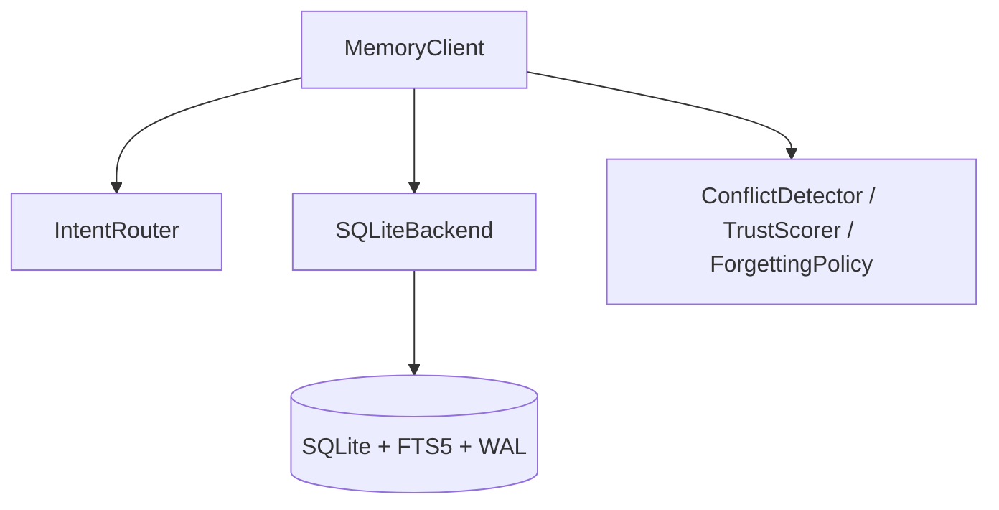
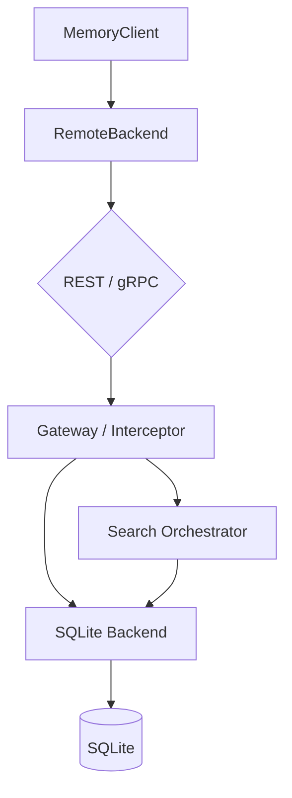
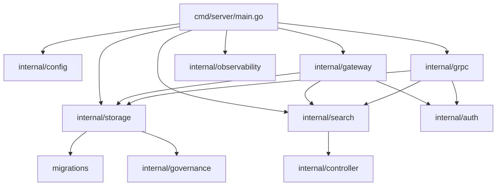
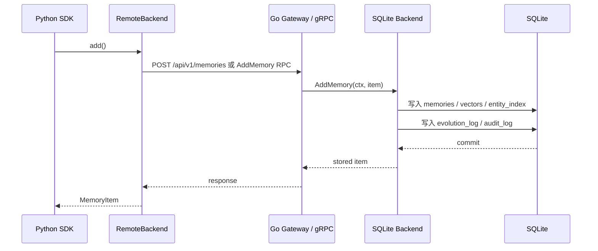
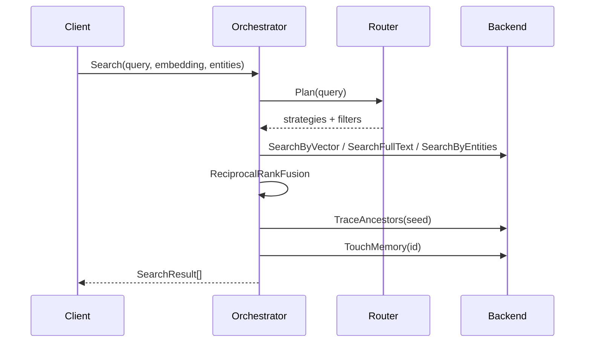

# 02 架构深度剖析
> 从双语言分工、请求链路和模块边界三个视角，完整理解系统架构。

## 前置知识

- [01 项目总览与动机](01-project-overview.md)

## 本文目标

完成阅读后，你将理解：

1. 为什么 Go 负责数据面，Python 负责智能面
2. 嵌入模式与服务模式的完整数据流
3. 核心模块之间如何协作
4. 存储、检索、认证、可观测性和关停流程如何串起来

## 双语言架构的职责划分

系统把职责拆成两层：

- **Python 智能面**：嵌入、实体提取、LLM 客户端、MCP、开发者入口
- **Go 数据面**：REST、gRPC、认证、中间件、检索编排、SQLite 服务端能力

这种划分让每一层都能围绕自己的优势演进。

| 维度 | Python | Go |
|------|--------|----|
| 主职责 | SDK、MCP、提取与模型集成 | 服务层、协议层、数据访问 |
| 典型文件 | `src/agent_memory/client.py` | `go-server/cmd/server/main.go` |
| 优势 | 开发效率高，生态完整 | 并发、部署、静态二进制 |

## 嵌入模式数据流

嵌入模式适合本地脚本、桌面工具和单进程 Agent。

这条路径的特点是：

- 部署最简单
- 网络开销为零
- 所有智能层逻辑都在同一进程

## 服务模式数据流

服务模式适合把 Go 服务单独部署，再由 Python SDK、CLI 或其他进程远程访问。

服务模式的重点收益有三项：

1. 服务层能力独立部署
2. Go 端统一承接认证、观测和并发请求
3. Python 端可保持 SDK 体验，同时通过远程后端访问数据

## 模块依赖关系

可把它理解成三层：

- **入口层**：`cmd/server/main.go`
- **协议层**：`gateway/`、`grpc/`
- **核心层**：`storage/`、`search/`、`controller/`、`governance/`

## 存储请求生命周期

以服务模式下的新增记忆为例：

这里有两个非常关键的设计点：

- 主表写入和治理日志写入处于同一个事务路径
- 关系索引和向量索引在新增时同步维护

## 检索请求生命周期

以融合检索为例：

查询链路里同时发生了三类事情：

- 意图分类
- 多路召回
- 后处理与访问刷新

## 数据模型如何在双端保持一致

`proto/memory/v1/models.proto` 定义了跨语言共享的数据契约。最核心的消息是 `MemoryItem`。

| 语义字段 | Protobuf | Go | Python |
|----------|----------|----|--------|
| 主键 | `id` | `memoryv1.MemoryItem.Id` | `MemoryItem.id` |
| 内容 | `content` | `Content` | `content` |
| 类型 | `memory_type` | `MemoryType` | `memory_type` |
| 向量 | `embedding` | `Embedding` | `embedding` |
| 关系 | `causal_parent_id` | `CausalParentId` | `causal_parent_id` |
| 标签 | `tags` | `Tags` | `tags` |

这种三方对应关系是后续调试和协议演进的基础。

## 关系模型

关系边定义在 `RelationEdge` 中，当前主要包括：

- `derived_from`
- `supersedes`
- `supports`
- `contradicts`
- `related_to`

它们分别覆盖：

- 来源关系
- 覆盖关系
- 支持关系
- 冲突关系
- 泛关联关系

## 治理架构

治理能力集中在三个方向：

1. **健康检查**：统计 stale/orphan/conflict 等指标
2. **审计日志**：记录对记忆的 create/update/delete 行为
3. **演化日志**：记录 created/updated/deleted 等事件

Go 端对应文件：

- `go-server/internal/governance/health.go`
- `go-server/internal/governance/export.go`
- `go-server/internal/governance/audit.go`

Python 端对应文件：

- `src/agent_memory/governance/health.py`
- `src/agent_memory/governance/export.py`
- `src/agent_memory/governance/audit.py`

## 认证链路

服务模式支持两类认证材料：

- `X-API-Key`
- `Authorization: Bearer <jwt>`

HTTP 侧通过 `go-server/internal/gateway/middleware.go` 串起中间件。gRPC 侧通过 `go-server/internal/grpc/interceptor.go` 读取 metadata。

这条链路的特点是：

- 若未配置 `APIKey` 和 `JWTSecret`，服务可直接放行
- 若任一材料匹配成功，请求即可继续

## 可观测性

当前 Go 服务已经具备三类观测能力：

- `slog` 日志：`internal/observability/logger.go`
- `Prometheus` 指标：`internal/observability/metrics.go`
- `OpenTelemetry` tracing 初始化：`internal/observability/tracing.go`

HTTP 层目前暴露：

- `/health`
- `/metrics`
- `/api/v1/info`

其中 `/api/v1/info` 补充了版本、构建信息、运行时版本、向量搜索模式和运行时长。

## 配置系统

Go 服务通过 `viper` 读取配置，入口在 `go-server/internal/config/config.go`。

常用字段包括：

- `AGENT_MEMORY_HTTP_ADDRESS`
- `AGENT_MEMORY_GRPC_ADDRESS`
- `AGENT_MEMORY_DATABASE_PATH`
- `AGENT_MEMORY_API_KEY`
- `AGENT_MEMORY_JWT_SECRET`
- `AGENT_MEMORY_SEMANTIC_LIMIT`
- `AGENT_MEMORY_RRF_K`

## 优雅关停

`go-server/cmd/server/main.go` 监听 `SIGINT` 和 `SIGTERM`，关停顺序如下：

1. 收到信号
2. 创建 5 秒超时上下文
3. `httpServer.Shutdown(ctx)`
4. `grpcServer.GracefulStop()`

这样做的目的是尽量让进行中的请求平滑收尾。

## 架构层面的阅读建议

若要快速入手代码，建议按下面的顺序：

1. `go-server/cmd/server/main.go`
2. `go-server/internal/gateway/handler.go`
3. `go-server/internal/grpc/server.go`
4. `go-server/internal/search/orchestrator.go`
5. `go-server/internal/storage/sqlite.go`
6. `src/agent_memory/client.py`
7. `src/agent_memory/storage/remote_backend.py`

## 小结

- 双语言架构把智能面和数据面分开，职责边界清晰
- 嵌入模式强调简单，服务模式强调可部署和可观测
- 检索链路由路由器、编排器和后端接口共同完成
- Protobuf 契约保证了 Go 与 Python 的模型一致性

## 延伸阅读

- [03 算法指南](03-algorithm-guide.md)
- [04 Go 服务端指南](04-go-server-guide.md)
- [05 Python SDK 指南](05-python-sdk-guide.md)
- [06 Protobuf 与 gRPC 通信](06-protobuf-grpc-guide.md)
