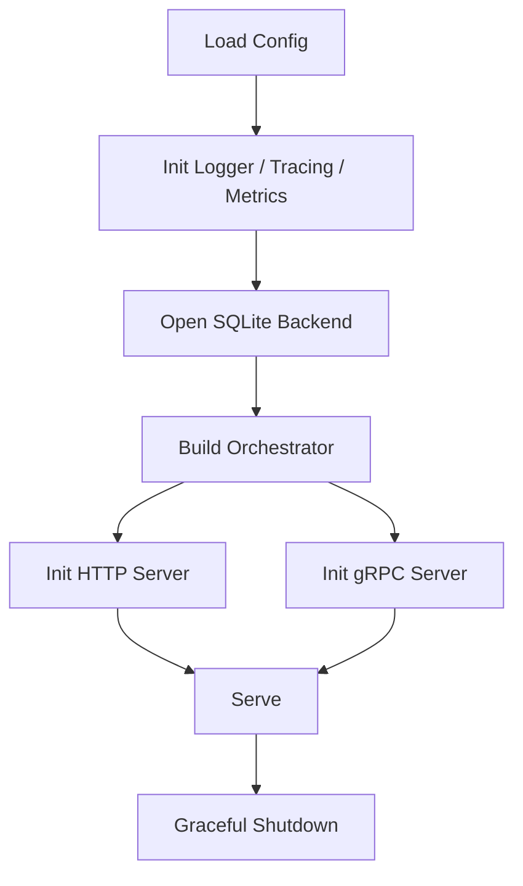

# 04 Go 服务端指南
> 以 Go 服务为主线，讲清入口、存储、网关、gRPC、认证、可观测性与 CLI。

## 前置知识

- [02 架构深度剖析](02-architecture-deep-dive.md)

## 本文目标

完成阅读后，你将理解：

1. Go 服务是如何启动并组织依赖的
2. SQLite 存储引擎如何维护主表、索引和治理日志
3. REST 与 gRPC 层分别做了什么
4. 服务端当前有哪些工程化能力

## 入口：`cmd/server/main.go`

Go 服务入口文件是 **`go-server/cmd/server/main.go`**。

启动顺序可以概括为：

代码中对应的关键步骤：

- `config.Load()`：读取环境变量与默认值
- `observability.NewLogger()`：构建 `slog` logger
- `storage.New()`：初始化数据库并应用迁移
- `search.New()`：创建检索编排器
- `gateway.NewHandler()`：注册 REST 路由
- `grpc.NewServer()`：注册 gRPC 服务

## 存储引擎：`internal/storage/sqlite.go`

核心文件是 **`go-server/internal/storage/sqlite.go`**。

它负责：

- 打开 `sqlite3` 连接
- 开启外键与 `WAL`
- 调用迁移器创建 schema
- 对记忆、向量、实体、关系、演化和审计做统一读写

新增记忆时，后端会在一个事务中完成四件事：

1. 写入 `memories`
2. 写入 `memory_vectors`
3. 写入 `entity_index`
4. 写入 `evolution_log` 与 `audit_log`

这让主数据和治理日志保持一致。

## Schema 迁移：`internal/storage/migrations/`

Go 服务没有在入口里直接拼接 SQL，而是通过迁移器集中管理 schema。

关键文件：

- **`go-server/internal/storage/migrations/migrator.go`**
- **`go-server/internal/storage/migrations/001_init.sql`**

这个结构的好处有三项：

- schema 变更有明确版本
- 初始化逻辑集中
- 将来扩展迁移时更容易做幂等控制

## 检索编排：`internal/search/orchestrator.go`

编排器是服务模式里的“查询中枢”。

它做的事情可以概括为：

- 调用 `Router.Plan()` 决定策略
- 调用后端执行 semantic / full-text / entity / causal trace
- 使用 `ReciprocalRankFusion` 做融合
- 调用 `TouchMemory()` 刷新访问计数

这种设计把“检索策略决策”与“底层数据查询”分开，便于测试。

## REST 网关：`internal/gateway/handler.go`

REST 路由入口在 **`go-server/internal/gateway/handler.go`**。

当前 HTTP 层已经覆盖：

- 健康与信息：`/health`、`/metrics`、`/api/v1/info`
- 记忆读写：`/api/v1/memories`
- 检索：`/api/v1/search/*`
- 追踪：`/api/v1/trace/*`
- 关系与治理：`/api/v1/relations`、`/api/v1/evolution`、`/api/v1/audit`

其中 `/api/v1/info` 会返回：

- 服务版本
- 构建信息
- Go 运行时版本
- 当前向量搜索模式
- 服务启动时间与运行时长

## 中间件栈：`internal/gateway/middleware.go`

HTTP 中间件顺序是：

1. `authMiddleware`
2. `loggingMiddleware`
3. `recoveryMiddleware`

顺序理由如下：

- 认证要尽早拦截无权限请求
- 日志希望覆盖实际业务处理时长
- recovery 放在外层，确保 panic 不会把进程直接打挂

## gRPC 服务：`internal/grpc/server.go`

gRPC 侧实现位于 **`go-server/internal/grpc/server.go`**，对应 `StorageService` 的 18 个 RPC。

它和 REST 层的关系可以理解为：

- REST 更适合调试、脚本和通用客户端
- gRPC 更适合强类型、低开销的服务间调用

两者底层共用同一个 `Backend` 和 `Orchestrator`，这样行为保持一致。

## gRPC 认证拦截器：`internal/grpc/interceptor.go`

认证逻辑从 metadata 中提取：

- `x-api-key`
- `authorization`

处理流程和 HTTP 中间件保持相同口径，避免出现“REST 能过、gRPC 不能过”的行为分叉。

## 认证子系统：`internal/auth/`

当前认证实现由两个小模块组成：

- **`go-server/internal/auth/apikey.go`**
- **`go-server/internal/auth/jwt.go`**

特点是简单、直接：

- 若未配置密钥，默认放行
- 配置了 API Key 或 JWT 之后，命中任一材料即可通过

对于当前项目定位，这个复杂度是合适的。后续若扩展多租户，可继续往前挂租户解析和权限策略。

## 可观测性：`internal/observability/`

Go 服务目前提供：

- `logger.go`：日志
- `metrics.go`：Prometheus 指标
- `tracing.go`：OpenTelemetry 初始化

已暴露的 Prometheus 指标包括：

- `memory_store_duration_seconds`
- `memory_search_duration_seconds`
- `memory_http_duration_seconds`
- `memory_total`
- `memory_conflicts_detected_total`

## 治理：`internal/governance/`

治理相关文件包括：

- **`health.go`**：读取健康快照
- **`audit.go`**：访问审计日志
- **`export.go`**：导出 JSONL

这部分逻辑刻意保持很薄，核心价值是把“治理能力”从存储实现里抽出来，方便后续扩展 CLI、API 或定时任务。

## 配置：`internal/config/config.go`

配置层使用 `viper`，当前字段集中在一个 `Config` 结构体里。

默认值覆盖：

- HTTP / gRPC 地址
- SQLite 路径
- 日志级别
- semantic / lexical / entity limit
- `RRFK`
- 请求超时

这让本地直接运行服务几乎不需要手动配置。

## CLI：`cmd/cli/main.go`

Go CLI 入口位于 **`go-server/cmd/cli/main.go`**，当前提供：

- `health`
- `store`
- `search`

它的定位更像轻量调试工具，而非完整用户 CLI。完整面向用户的入口仍是 Python 的 `agent-memory` 命令。

## Go 惯用模式

从代码风格看，这个服务已经体现了几个比较典型的 Go 工程习惯：

- 通过接口收窄依赖面，例如 `search.Backend`
- 使用 `context.Context` 贯穿请求边界
- 使用 `defer tx.Rollback()` 保证事务失败时能收口
- 在入口统一处理优雅关停
- 用测试替身覆盖编排器和治理模块

## 服务端调试建议

如果要快速调试 Go 服务，建议按下面的顺序：

1. `cd go-server && go test ./...`
2. `cd go-server && go run ./cmd/server`
3. `curl http://127.0.0.1:8080/health`
4. `curl http://127.0.0.1:8080/api/v1/info`
5. `make go-bench`

## 小结

- Go 服务承接了协议层、数据面和工程化能力
- 存储、编排、REST 和 gRPC 的边界比较清晰
- 当前服务已经具备认证、观测、治理和基础 CLI
- 后续继续扩展时，优先关注多租户、观测细化和更完整的服务端治理任务

## 延伸阅读

- [05 Python SDK 指南](05-python-sdk-guide.md)
- [06 Protobuf 与 gRPC 通信](06-protobuf-grpc-guide.md)
- [08 部署指南](08-deployment-guide.md)
- [10 测试与质量指南](10-testing-quality-guide.md)
