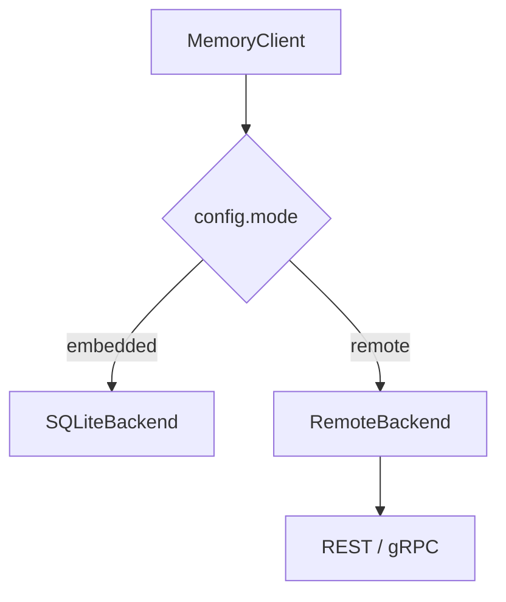

# 05 Python SDK 指南
> 以 `MemoryClient` 为中心，讲清 Python 端如何承接提取、检索、治理与接口集成。

## 前置知识

- [02 架构深度剖析](02-architecture-deep-dive.md)

## 本文目标

完成阅读后，你将理解：

1. `MemoryClient` 为什么是 Python 端统一入口
2. 嵌入模式与远程模式在 SDK 侧如何切换
3. `add()`、`search()`、`ingest_conversation()` 和 `maintain()` 的执行路径
4. Python 端如何集成 embedding、LLM 和 MCP

## 统一入口：`MemoryClient`

核心文件是 **`src/agent_memory/client.py`**。

`MemoryClient` 初始化时会组装以下组件：

- `backend`
- `embedding_provider`
- `entity_extractor`
- `router`
- `llm_client`
- `pipeline`
- `forgetting_policy`
- `trust_scorer`
- `conflict_detector`
- `consolidation_planner`
- `health_monitor`

这意味着调用方通常只需要创建一个对象，就能使用完整能力。

## 双模式架构

`_build_backend()` 会根据配置决定后端：

- `mode=embedded` → `SQLiteBackend`
- `mode=remote` → `RemoteBackend`



这种封装让调用层几乎不用感知运行模式差异。

## `add()` 方法走读

`add()` 的主要步骤如下：

1. 生成 embedding
2. 计算基础 trust score
3. 提取实体
4. 构造 `MemoryItem`
5. 写入后端
6. 建立结构关系
7. 扫描冲突并按需要回写

相关文件：

- **`src/agent_memory/client.py`**
- **`src/agent_memory/embedding/local_provider.py`**
- **`src/agent_memory/extraction/entity_extractor.py`**
- **`src/agent_memory/controller/conflict.py`**

## `search()` 方法走读

嵌入模式下，`search()` 会在 Python 进程里完成：

- 意图路由
- 多路召回
- RRF 融合
- `touch_memory()`

远程模式下，`search()` 会先生成 embedding 和实体，再把查询发给 Go 服务的 `/api/v1/search/query` 或 `SearchQuery` RPC。

这让 Python SDK 既能作为完整执行引擎，也能作为远程服务客户端。

## `ingest_conversation()`

`ingest_conversation()` 接收 `ConversationTurn[]`，交给 `ConversationMemoryPipeline` 处理。

职责拆分如下：

- `pipeline.py`：编排对话到记忆草稿的流程
- `entity_extractor.py`：抽取实体引用
- `prompts.py`：维护提取提示词

最终输出是 `MemoryDraft[]`，再逐条进入 `add_from_draft()`。

## `maintain()`

维护周期的目标有四项：

1. 计算记忆强度
2. 决定升层或降层
3. 处理冲突维护
4. 生成 consolidation 候选

返回值是 `MaintenanceReport`，其中包含：

- `promoted`
- `demoted`
- `decayed`
- `conflicts_found`
- `conflicts_resolved`
- `consolidated`

## `trace_graph()`

`trace_graph()` 会聚合：

- 焦点记忆
- 祖先链
- 后代链
- 关系边
- 演化事件

这让上层应用可以完整展示一条记忆的上下文，而不是只看单点内容。

## 存储后端

### `SQLiteBackend`

文件：**`src/agent_memory/storage/sqlite_backend.py`**

主要能力：

- schema bootstrap
- `WAL`
- `FTS5`
- `sqlite-vec` 优先，余弦扫描回退
- 因果追踪
- 关系查询
- 审计与演化日志

### `RemoteBackend`

文件：**`src/agent_memory/storage/remote_backend.py`**

主要职责：

- 序列化 Python dataclass
- 通过 HTTP 或 gRPC 发请求
- 反序列化远端返回的 Protobuf / JSON
- 注入认证头

## 提取管线

提取管线主要服务于对话记忆场景：

- 先尝试 LLM 提取
- 若 LLM 不可用，则退回启发式规则

这一点很重要，因为它让项目在“有模型”和“没有模型”两种环境里都能工作。

## Embedding 提供器

当前实现包括：

- `local_provider.py`
- `openai_provider.py`

同时保留 hash/fallback 路径，方便测试和离线运行。

## LLM 客户端

当前 Python 端提供两类客户端：

- **`src/agent_memory/llm/ollama_client.py`**
- **`src/agent_memory/llm/openai_client.py`**

它们的主要职责是：

- 发请求
- 约束 JSON 输出格式
- 服务于提取或冲突复判任务

## MCP 服务器

文件：**`src/agent_memory/interfaces/mcp_server.py`**

当前 MCP 工具共 11 个：

- `memory_store`
- `memory_search`
- `memory_ingest_conversation`
- `memory_trace`
- `memory_health`
- `memory_audit`
- `memory_evolution`
- `memory_update`
- `memory_delete`
- `memory_maintain`
- `memory_export`

它们基本覆盖了一个 Agent 客户端最常用的记忆操作。

## 配置：`AgentMemoryConfig`

文件：**`src/agent_memory/config.py`**

核心字段包括：

- `database_path`
- `mode`
- `go_server_url`
- `grpc_target`
- `prefer_grpc`
- `api_key`
- `jwt_token`
- `semantic_limit`
- `default_search_limit`
- `rrf_k`

## SDK 调试建议

建议从最短路径开始：

```bash
PYTHONPATH=src .venv/bin/python -c 'from agent_memory import MemoryClient; c = MemoryClient(); print(c.health())'
```

然后再逐步切到：

- `mode=remote`
- 自定义 embedding provider
- LLM 提取
- MCP server

## 小结

- `MemoryClient` 把 Python 端能力收敛成一个统一入口
- 同一套 SDK 同时支持嵌入模式和远程模式
- Python 端承接了提取、embedding、MCP 和部分治理逻辑
- 远程模式下，Python 端仍保持熟悉的调用体验

## 延伸阅读

- [03 算法指南](03-algorithm-guide.md)
- [06 Protobuf 与 gRPC 通信](06-protobuf-grpc-guide.md)
- [09 API 参考](09-api-reference.md)
- [10 测试与质量指南](10-testing-quality-guide.md)
