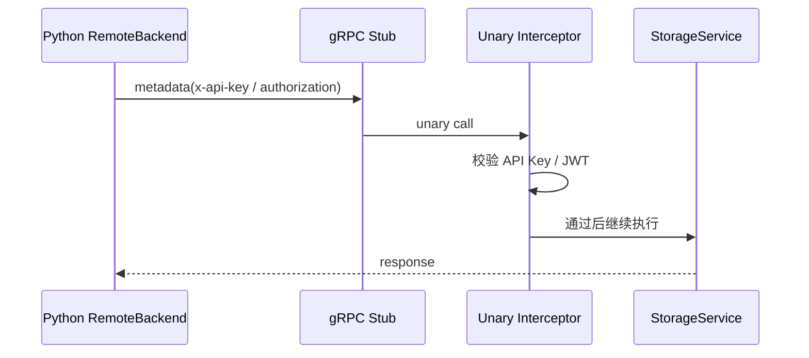

# 06 Protobuf 与 gRPC 通信
> 从契约定义、代码生成和认证传播三个层面，理解双语言通信机制。

## 前置知识

- [04 Go 服务端指南](04-go-server-guide.md)
- [05 Python SDK 指南](05-python-sdk-guide.md)

## 本文目标

完成阅读后，你将理解：

1. 为什么项目需要 `Protobuf`
2. `models.proto` 与 `storage_service.proto` 分别承担什么职责
3. Python 与 Go 如何消费生成代码
4. gRPC 认证与 REST 认证的异同

## 为什么使用 Protobuf

本项目同时有 Go 服务端和 Python SDK。只靠手写 JSON 结构，很容易出现字段漂移、类型不一致和文档失真。

`Protobuf` 提供了三项关键收益：

- 统一契约
- 稳定的代码生成
- 更清晰的字段演进路径

## Proto 文件结构

当前目录在 **`proto/memory/v1/`**：

- `models.proto`：数据模型
- `storage_service.proto`：18 个存储相关 RPC
- `ai_service.proto`：预留 AI 服务契约

## 数据模型：`models.proto`

最关键的消息如下：

- `MemoryItem`
- `RelationEdge`
- `SearchResult`
- `EvolutionEvent`
- `AuditEvent`
- `HealthSnapshot`

其中 `MemoryItem` 共有 19 个字段，覆盖内容、向量、时间、可信度、关系引用和标签。

## RPC：`storage_service.proto`

当前 `StorageService` 提供 18 个 RPC，可按职责分组理解：

- 记忆写入：`AddMemory`、`UpdateMemory`、`DeleteMemory`
- 记忆读取：`GetMemory`、`ListMemories`
- 检索：`SearchQuery`、`SearchFullText`、`SearchByEntities`、`SearchByVector`
- 追踪：`TraceAncestors`、`TraceDescendants`
- 关系：`AddRelation`、`ListRelations`、`RelationExists`
- 治理：`GetEvolutionEvents`、`GetAuditEvents`、`HealthCheck`
- 行为刷新：`TouchMemory`

## 代码生成流程

根目录 `Makefile` 的 `proto` 目标同时生成两套代码：

```bash
make proto
```

输出目录：

- Go：`go-server/gen/memory/v1/`
- Python：`src/agent_memory/generated/memory/v1/`

## Go 端如何使用生成代码

Go 端典型使用方式：

- 在服务端注册：`memoryv1.RegisterStorageServiceServer`
- 构造模型：`memoryv1.MemoryItem{}`
- 作为 handler / service 的参数与返回值

典型文件：

- `go-server/internal/grpc/server.go`
- `go-server/cmd/server/main.go`

## Python 端如何使用生成代码

Python 端的生成代码主要用于 `RemoteBackend`：

- 构造 request message
- 调用 stub
- 把 response 转回 Python dataclass

典型文件：

- `src/agent_memory/storage/remote_backend.py`
- `src/agent_memory/generated/memory/v1/storage_service_pb2.py`
- `src/agent_memory/generated/memory/v1/storage_service_pb2_grpc.py`

## gRPC metadata 认证传播

gRPC 不像 HTTP 那样有固定头结构，因此项目把认证材料放在 metadata 中传递。



## REST 与 gRPC 的取舍

| 维度 | REST | gRPC |
|------|------|------|
| 调试体验 | 更直接 | 需要客户端或生成代码 |
| 类型约束 | 较弱 | 更强 |
| 传输开销 | JSON 较大 | 二进制更紧凑 |
| 适用场景 | 脚本、浏览器、手工调试 | 服务间通信、强类型调用 |

项目同时保留两条路径，目的是让可用性和工程性都不缺位。

## 小结

- `Protobuf` 是双语言协作的基础设施
- `models.proto` 管数据模型，`storage_service.proto` 管 RPC 契约
- Go 和 Python 都围绕生成代码工作
- gRPC metadata 让认证链路在两种协议下保持一致

## 延伸阅读

- [04 Go 服务端指南](04-go-server-guide.md)
- [05 Python SDK 指南](05-python-sdk-guide.md)
- [09 API 参考](09-api-reference.md)
