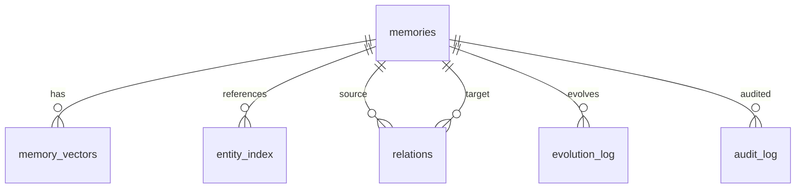

# 07 数据库与 Schema 指南
> 以 SQLite schema 为中心，理解表结构、索引、FTS5、向量检索与追踪关系。

## 前置知识

- [02 架构深度剖析](02-architecture-deep-dive.md)

## 本文目标

完成阅读后，你将理解：

1. 为什么项目选择 SQLite
2. 当前 schema 包含哪些核心表
3. 各类索引分别服务什么查询
4. FTS5 与向量检索在数据库侧如何落地

## 为什么是 SQLite

SQLite 很适合当前仓库的目标场景：

- 本地优先
- 单文件部署
- 对读多写少场景友好
- 支持 `WAL`
- 自带 `FTS5`

## Schema 总览

Python 端 schema 位于 **`src/agent_memory/storage/schema.sql`**，Go 端 schema 位于 **`go-server/internal/storage/schema.sql`**。

当前核心对象包括：

- `memories`
- `memory_vectors`
- `entity_index`
- `relations`
- `evolution_log`
- `audit_log`

Python 端额外有：

- `backend_meta`

## 表结构职责

### `memories`

主表，负责保存：

- 记忆文本
- 类型
- 时间字段
- trust / importance / layer / decay
- 关系引用
- tags 与 deleted_at

### `memory_vectors`

保存向量及其和 `memories` 行号之间的映射。

### `entity_index`

把实体引用摊平成 `(entity, memory_id)` 结构，便于实体查询。

### `relations`

保存关系边，支撑因果、冲突、支持、覆盖等结构化连接。

### `evolution_log`

保存演化事件，例如：

- created
- updated
- deleted

### `audit_log`

保存审计事件，强调“谁对什么做了什么”。

## 索引策略

当前 schema 明确创建了 15 个常规索引，覆盖：

- `memory_type`
- `layer`
- `created_at`
- `last_accessed`
- `trust_score`
- `source_id`
- `causal_parent_id`
- `supersedes_id`
- `deleted_at`
- `(deleted_at, memory_type, created_at)`
- `entity_index(memory_id)`
- `relations(source_id, relation_type)`
- `relations(target_id, relation_type)`
- `evolution_log(memory_id, created_at)`
- `audit_log(target_id, created_at)`

这些索引基本对应三类热点：

1. 过滤与排序
2. 追踪链路
3. 治理日志读取

## FTS5：`memories_fts`

Python 端 schema 还创建了一个虚拟表：

- `memories_fts`

它主要存放：

- `content`
- `tags`

并通过触发器与主表同步，支撑全文检索与 `bm25` 排序。

## 向量检索

### Python 端

Python 端优先尝试 `sqlite-vec`，失败后退回纯 Python 余弦扫描。

### Go 端

Go 端当前使用内存中的余弦相似度扫描，没有启用 `sqlite-vec`。

这也是 `/api/v1/info` 返回 `vector_search_mode=cosine_scan` 的原因。

## WAL 模式

两端都在非 `:memory:` 数据库上启用 `WAL`。这样做的主要收益是：

- 读写可以并发得更顺畅
- 更适合 Agent 场景下“频繁读、适度写”的访问模式

## 因果追踪与外键

`memories.causal_parent_id` 形成了自引用链。追踪祖先和后代时，代码会用递归查询展开整条链路。

关系边则由 `relations` 表单独维护，用来承接更广义的图关系。

## ER 图

## 数据库排错建议

排查数据库问题时，建议先看：

1. `memories`
2. `memory_vectors`
3. `entity_index`
4. `relations`
5. `evolution_log`
6. `audit_log`

若全文检索异常，再检查 `memories_fts` 与相关触发器。

## 小结

- SQLite schema 已经覆盖主数据、索引、追踪和治理
- Python 端额外提供 `backend_meta` 和 `FTS5` 虚拟表
- 15 个常规索引服务于高频过滤、追踪和日志读取
- 向量检索当前是“Python 端优先 `sqlite-vec`，Go 端余弦扫描”

## 延伸阅读

- [03 算法指南](03-algorithm-guide.md)
- [04 Go 服务端指南](04-go-server-guide.md)
- [11 性能与基准测试](11-performance-benchmarking.md)
